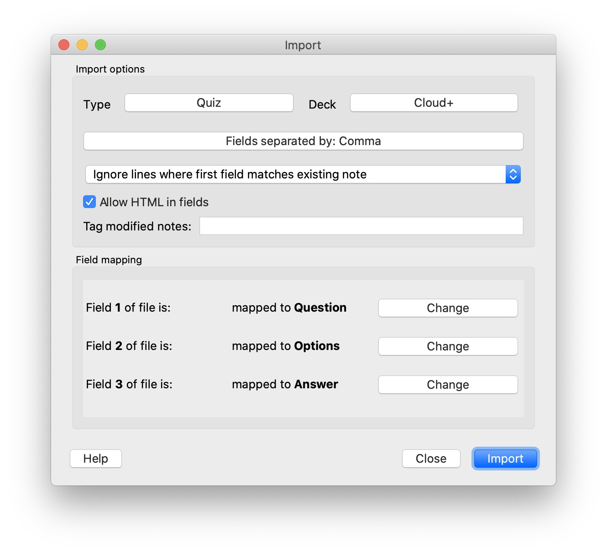

# Questions Scraper -> Anki Deck


## Input
The script "questionsscraper.py" takes URLs to traverse. The code includes the following URL set:

```https://vceguide.com/comptia/cv0-002-comptia-cloud/page/X/"```

and iterates first 13 pages to find quiz questions.
You can change it in the code lines 45-46.

## Output
The scropt will produce a CSV file with three fields: questions, options and the correct answer.
The options might have commas in it, which can break the import later. If it's the case, use Exce or Atom or something to edit it as appriopriate. 

I have changed the commas in the options with the <br> symbols, to break it down in Anki later.
## Anki Import
Create Note Type (Tools->Manage Note Types) that takes 3 fields : 
1. questions
1. options
1. answer

Create a new deck and import file. Check field mapping.
Allow HTML in fields.

